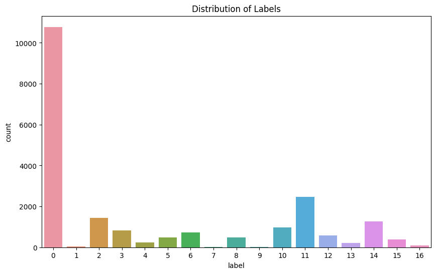

# MM
Group project - Machine learning (P.11)

Ken  
Edward  
Andrea  
Natalia  

## Reports 
### Backgorund
 
Hyperspectral data provide a lot of information for the remote discrimination of ground truth, however, since spectral dimensions are usually many, the possibility of information redundancy is presented. Data analysis and interpretation of hyperspectral images can also be a challenge.  

The goal of the group assignmnet was to exploit the tools for machine learning to analyze hyperspectral images of Indian pine fields to provide information for remote discrimination of subtle differences in the ground truth.  

### Exploratory Data Analysis
- Data Description  

Exploratory Data analysis of our choice focused on, first understanding the dataset probing the overall description of the dataset. Pixel sizes (data) contained in 200 bands of image were analyzed for the presence of redundancy of the data they all held.  

This was achieved through the assesment of interband correlation. Of the first 15 bands, band1 had the weakest correlation with the remainig bands (bands2-band15), showing a very strong correlation between band2 to 15 with coefficients ranging between 0.7 to 0.9 in most combinations.  

The correlation coefficients of the bands with the class (specie) column was analyzed. The highest correlation coefficient was estimated to be ~ 0.23. Selected Bands with Correlation Coefficient >= 0.238 with the Class (Specie) Column were as follows: 

| Band ID | Correlation Coefficient with the Class Column |
|---------|----------------------------------------------|
| band147 | 0.245247                                     |
| band148 | 0.245009                                     |
| band149 | 0.242812                                     |
| band150 | 0.242855                                     |
| band151 | 0.238947                                     |
| band153 | 0.238003                                     |
| band155 | 0.239565                                     |
| band184 | 0.238006                                     |
| band185 | 0.241086                                     |
| band188 | 0.238426                                     |
| band190 | 0.239321                                     |
| band191 | 0.238504                                     |
| band192 | 0.239755                                     |
| band193 | 0.241024                                     |
| band194 | 0.242920                                     |
| band195 | 0.238310                                     |
| band196 | 0.240277                                     |

It was obvious that these bands were strongly correlated as well, hence any two of them, could most probably be used to train an algorithm to make predictions.  

A plot of the pixel distribution of the 'Class' column for band196  is presented below: 
  

Fig. 1: Pixel distribution from different classed of objects
 

  

Fig. 2: Labels distribution

The distribution of classes inside the dataset (fig. 2) showed that the number of samples associated to class label '0' only, (which is associated to no presence of pines), was comparable in magnitude to the sum of all the remaining target classes from '1' to '16'. This observation suggested that objects of class '0' could create an imbalance in the next multivariate classification of the pine species.

Figure 3a and 3b show a simple Linear Discriminant Analysis (LDA) and a t-Distributed Stochastic Neighbor Embedding (t-SNE) was used to visualize the  high-dimensional raw data in lower-dimensional spaces, typically 3D and 2D respectively.   

  
Fig. 3a:

  
Fig. 3b:

It was clear that objects from class '0' cluttered the discrepancies obtained.  

We then dropped the class '0', based on these preliminary Exploratory Data Analysis on the raw dataset. Hence, considering just 2 classes, the '0' class associated to no pines presence, and class '1' with considers the presence of pines was appropriate for training and testing.   
This choice was made in consideration that the prominent Correlation Coefficient for the bands would be mostly associated to the target classes '0' and '1', followed by a Principal Component Analysis (PCA) to sort the dataset according to the most important features.
The modified dataset is then standardized, fitted. transformed and a binary classification is performed on it using the Random Forest classifier. We consider only the output of the model which predicts the presence of pine species (so class '1'), to help the next multivariate classification and improve the accuracy score of the prediction.  

Principal Component Analysis   
it is a method that is used to reduce the dimension of the features, in this case from 200 bands to a more manageable number of bands. The PCA implies the maximization of the sum of the feature projections onto chosen principal directions, or components. The principal components are generally fewer than the total number of features, but they are still carrying enough information for the classification model and are sorted by most to least principality.  

The number of principal components can be deduced, as an example, by observing the Explained Variance Ratio plot and its cumulative variant, which is a measure of the variance from one component to the next: the presence of a knee point between the first principal components and the rest of them may be a signal of a break in significance between ranges of components.  

During the first EDA before binary classification, a number of principal components was fixed to 8, from the observation of Explained Variance Ratio and its cumulative.  

Linear Discriminant Analysis  
It is a technique to reduce the dimensionality and help classification, by finding the linear combinations of features that best separate the different classes in the dataset.
It is best employed before the application of a classificaton algorithm, by maximizing the distance between the means of different classes and minimizing the spread within each class, thus enhancing the discriminatory power of the features and the accuracy of the classification.

## Classification report
### Random Forest
Run: python pinesClass.py -RF #

### Logistic Regression (LogR)

### Support Vector Classification (SVC)

### Gaussian Naive Bayes (Gaussian NB)

