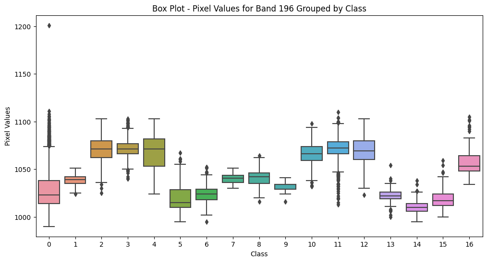

# MM
Group project - Machine learning (P.11)

Ken 
Edward 
Andrea 
Natalia

# Report

## Backgorund
 
Hyperspectral data provide a lot of information for the remote discrimination of ground truth, however, since spectral dimensions are usually many, the possibility of information redundancy is presented. Data analysis and interpretation of hyperspectral images can also be a challenge.  

The goal of the group assignmnet was to exploit the tools for machine learning to analyze hyperspectral images of Indian pine fields to provide information for remote discrimination of subtle differences in the ground truth.  

The dataset consists of 200 satellite images of the same area, each corresponds to the one spectral band of the remote sensor. We expect different types of the land surface 
to have a different reflectivity among those 200 bands. We will make at attempte to classify land types according to their representation on images in different bands.  

We also have a "reference": the images that contains "target": classified patters of the surface, e.g. 'Corn-notill', 'Corn', etc.  
Assuming we trained our model on this dataset, e.g. managed to predic the type of the land surface on the satellte imagery this can further be applied
for the classification of the same 200 bands on the satellite imagery for the other areas.  

## Exploratory Data Analysis
- PCA  

We first expore the data by plotting images for random bands. There are several patterns that can be observed from this simple procedure, this suggest 
some land types are clearly distinguishable in different satellite bands.

Figure 1. Example of the satellite images in different spectral bands. 

As a first step we apply a Pricipal Components decomposition to the 200 matrixes of the size 145x145 to see
whether PCs are (i) distiguashable between each other and (ii) how many PCs we need to describe most of the varibility
in the dataset. These anlysis allows to see the clusters in the data and quantify the measure of their
"separation" to make further descision for the methods of analysis.  

The PCs analysis shows that first 5 PCs expaling more than 92% of the total variability in the dataset.
While  

PC 1 explains 0.68 %  
PC 2 explains 0.19 %  

There is also a clear clustering of the data points in PCs space (Figure 2), suggesting that data clusters are
separated and can be further analysed succesfully with machine learning methods. 

Figure 2. First 3 PCAs plotted in a 3D space.  

The next step was to check whether the reconstucted images only applying first 10 PCs would
reflect the main features to be carptured by machine learning techniques. Figure 3 demonstrates
those reconstructed images and we conclude that images are well reflecting the land features
we want to classify. 

Figure 3. Reconstructed images (applying inverse transform with first 10 PCs) of for the different bands.  

Exploratory Data analysis of our choice focused on, first understanding the dataset probing the overall description of the dataset. Pixel sizes (data) contained in 200 bands of image were analyzed for the presence of redundancy of the data they all held. 
This was achieved through the assesment of interband correlation. Of the first 15 bands, band1 had the weakest correlation with the remainig bands (bands2-band15), showing a very strong correlation between band2 to 15 with coefficients ranging between 0.7 to 0.9 in most combinations.  

The correlation coefficients of the bands with the class (specie) column was analyzed. The highest correlation coefficient was estimated to be ~ 0.23. Selected Bands with Correlation Coefficient >= 0.238 with the Class (Specie) Column were as follows: 

| Band ID | Correlation Coefficient with the Class Column |
|---------|----------------------------------------------|
| band147 | 0.245247                                     |
| band148 | 0.245009                                     |
| band149 | 0.242812                                     |
| band150 | 0.242855                                     |
| band151 | 0.238947                                     |
| band153 | 0.238003                                     |
| band155 | 0.239565                                     |
| band184 | 0.238006                                     |
| band185 | 0.241086                                     |
| band188 | 0.238426                                     |
| band190 | 0.239321                                     |
| band191 | 0.238504                                     |
| band192 | 0.239755                                     |
| band193 | 0.241024                                     |
| band194 | 0.242920                                     |
| band195 | 0.238310                                     |
| band196 | 0.240277                                     |

It was obvious that these bands were strongly correlated as well, hence any two of them, could most probably be used to train an algorithm to make predictions.  

A plot of the pixel distribution of the 'Class' column for band196  is presented below: 
  

Fig. 4: 
 

- Linear Discriminant Analysis

In supervised learning, a training data set consisting of input–output pairs is available, and a Machine Learning algorithm is trained with the goal of providing predictions of the desired output for unseen input values.
