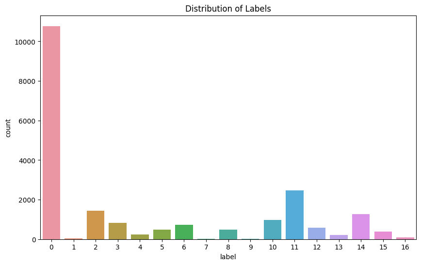

# MM
Group project - Machine learning (P.11)

Ken 
Edward 
Andrea 
Natalia

## Reports 
### Backgorund
 
Hyperspectral data provide a lot of information for the remote discrimination of ground truth, however, since spectral dimensions are usually many, the possibility of information redundancy is presented. Data analysis and interpretation of hyperspectral images can also be a challenge.  

The goal of the group assignmnet was to exploit the tools for machine learning to analyze hyperspectral images of Indian pine fields to provide information for remote discrimination of subtle differences in the ground truth.  

### Exploratory Data Analysis
- Data Description  

Exploratory Data analysis of our choice focused on, first understanding the dataset probing the overall description of the dataset. Pixel sizes (data) contained in 200 bands of image were analyzed for the presence of redundancy of the data they all held.  

This was achieved through the assesment of interband correlation. Of the first 15 bands, band1 had the weakest correlation with the remainig bands (bands2-band15), showing a very strong correlation between band2 to 15 with coefficients ranging between 0.7 to 0.9 in most combinations.  

The correlation coefficients of the bands with the class (specie) column was analyzed. The highest correlation coefficient was estimated to be ~ 0.23. Selected Bands with Correlation Coefficient >= 0.238 with the Class (Specie) Column were as follows: 

| Band ID | Correlation Coefficient with the Class Column |
|---------|----------------------------------------------|
| band147 | 0.245247                                     |
| band148 | 0.245009                                     |
| band149 | 0.242812                                     |
| band150 | 0.242855                                     |
| band151 | 0.238947                                     |
| band153 | 0.238003                                     |
| band155 | 0.239565                                     |
| band184 | 0.238006                                     |
| band185 | 0.241086                                     |
| band188 | 0.238426                                     |
| band190 | 0.239321                                     |
| band191 | 0.238504                                     |
| band192 | 0.239755                                     |
| band193 | 0.241024                                     |
| band194 | 0.242920                                     |
| band195 | 0.238310                                     |
| band196 | 0.240277                                     |

It was obvious that these bands were strongly correlated as well, hence any two of them, could most probably be used to train an algorithm to make predictions.  

A plot of the pixel distribution of the 'Class' column for band196  is presented below: 
  

Fig. 1: 
 

  

Fig. 2: Labels distribution

The distribution of classes inside the dataset (fig. 2) shows that the number of samplings associated to class label '0', (which is associated to no presence of pines), is comparable in magnitude to the sum of all other target classes fro '1' to '16'. This could create an imbalance in the next multivariate classification of the pine species.
We then dropped the class '0', by using a preliminary Exploratory Data Analysis on a dataset considering just 2 classes, the '0' class associated to no pines presence, and class '1' with considers the presence of pines. This preliminary EDA considers the prominent Correlation Coefficient for the bands mostly assocted to the classes '0' and '1', then a Principal Component Analysis (PCA) to sort the dataset according to the most important features.
 The modified dataset is then standardized, fitted. transformed and a binary classification is performed on it using the Random Forest classifier. We consider only the output of the model which predicts the presence of pine species (so class '1'), to help the next multivariate classification and improve the accuracy score of the prediction. 

- Principal Component Analysis

- Linear Discriminant Analysis

In supervised learning, a training data set consisting of input–output pairs is available, and a Machine Learning algorithm is trained with the goal of providing predictions of the desired output for unseen input values.