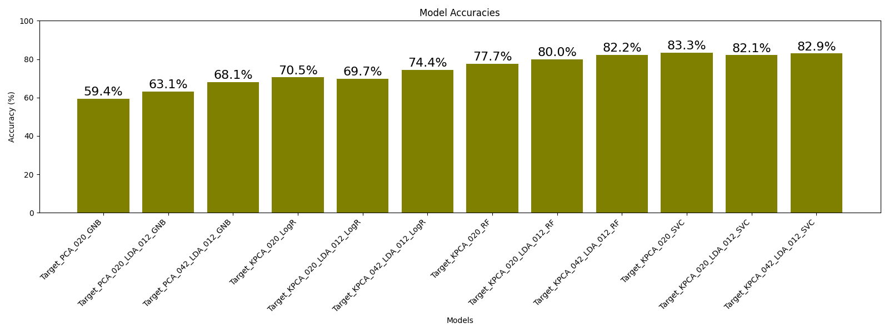
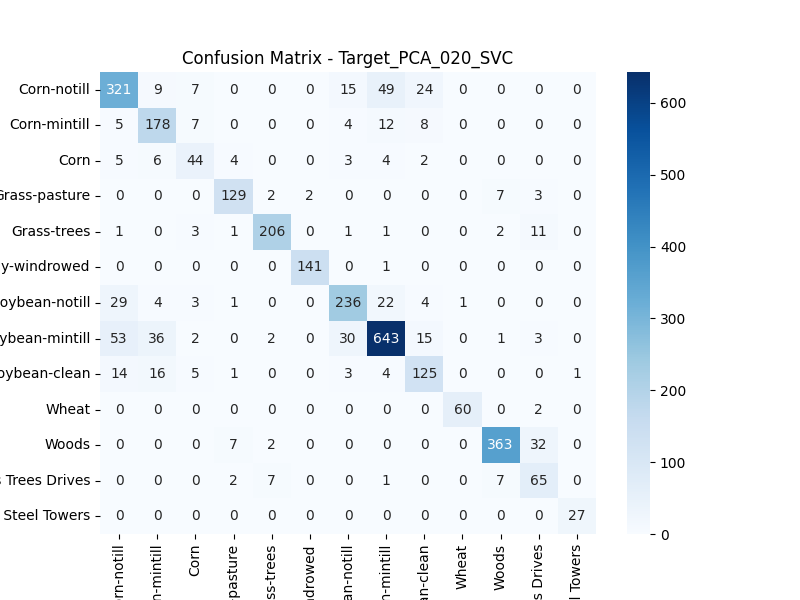
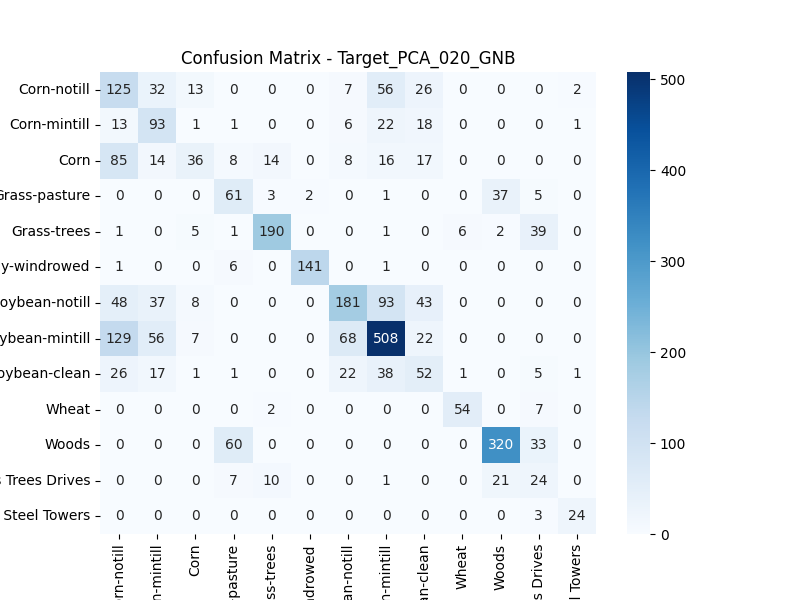

# MM
Group project - Machine learning (P.11)

Ken 
Edward 
Andrea 
Natalia

# Report

## Project strategy 

**STEP 1** Exploratory Data Analysis (EDA) 

_1. Data Loading:_
The script loads the "Indian Pines" dataset and its ground truth labels.
The dataset includes information about different bands and their corresponding labels. 
_2. Data Preprocessing:_
The script performs data cleaning and preprocessing steps, including standardization using StandardScaler.
It checks if the data has been previously computed; if not, it processes the data and saves it for future use. 
3._Visualizations:_
Visualizations of the ground truth labels and correlation matrix. 

**STEP 2** Dimensionality Reduction (PCA and LDA) 

_4. Principal Component Analysis (PCA):_
If PCA is enabled (--pca option), the script applies PCA to reduce the dimensionality of the data.
Visualizations include the explained variance ratio plot and scatter plots of principal components. 
_5. Linear Discriminant Analysis (LDA):_
If LDA is enabled (--lda option), the script applies LDA for further dimensionality reduction.
Visualizations include the explained variance ratio plot and scatter plots of linear components. 

**STEP 3** Model Training and Testing 

_6. Data Splitting:_
The dataset is split into training and testing sets based on the specified ratio (--test option). 
_7. Model Training:_
The script supports various classifiers such as Random Forest (--RF), Support Vector Classifier (--SVC), Logistic Regression (--LogR), and Gaussian Naive Bayes (--GNB). Model training is performed using the training set, and hyperparameter tuning is conducted using GridSearchCV. 
_8. Model Testing:_
If a separate test set is specified, the trained models are applied to make predictions on the test set. 

**STEP 4** Model Evaluation and Reporting 

_9. Model Evaluation:_
For each trained model, the script evaluates its performance using metrics like accuracy, classification report, confusion matrix,
precision, recall, and F1-score. These reports are displayed in the console.  

Generally, our script provides insights into the classification performance of different machine learning models on the "Indian Pines" dataset. 

## Background
 
Hyperspectral data provide a lot of information for the remote discrimination of ground truth, however, since spectral dimensions are usually many, the possibility of information redundancy is presented. Data analysis and interpretation of hyperspectral images can also be a challenge.  

The goal of the group assignmnet was to explore machine learning tools to analyze hyperspectral images of Indian pine fields to classify land surfaces according to the groud truth proveded.  

The dataset consists of 200 satellite images of the same area, each corresponds to the one spectral band of the remote sensor. We expect different types of the land surface 
to have a different reflectivity among those 200 bands. We will make at attempt to classify land types according to their representation on images in different bands.  

We also have a "reference": the images that contains "target": classified patters of the surface, e.g. 'Corn-notill', 'Corn', etc.  
Assuming we trained our model on this dataset, e.g. managed to predic the type of the land surface on the satellte imagery this can further be applied
for the classification of the same 200 bands on the satellite imagery for the other areas.  

## Exploratory Data Analysis

_Important note_: All 0 values and values of the target that covered sparsely by the data were removed, or classified as NaNs. The sparsely covered
targets are: 0, 1, 7 and 9. In the end we analyse tagets: 2, 3, 4, 5, 6, 8, 10-16. 13 in total, each for one type of the land. 

**Figure 1.** Binned distriburion of the image cells with different features (e.g. land types).

- **Principal Components Analysis**  

We first expore the data by plotting images for random bands. There are several patterns that can be observed from this simple procedure, this suggest 
some land types are clearly distinguishable in different satellite bands.

**Figure 2.** Example of the satellite images in different spectral bands. 

As a first step we apply a Pricipal Components decomposition to the 200 matrixes of the size 145x145 to see
whether PCs are (i) distiguashable between each other and (ii) how many PCs we need to describe most of the varibility
in the dataset. These anlysis allows to see the clusters in the data and quantify the measure of their
"separation" to make further descision for the methods of analysis.  

The PCs analysis shows that first 5 PCs expalin more than 92% of the total variability in the dataset.
While  

PC 1 explains 0.68 %  
PC 2 explains 0.19 %  

There is also a clear clustering of the data points in PCs space (Figure 2), suggesting that data clusters are
separated and can be further analysed succesfully with machine learning methods. 

**Figure 3.** First 3 PCAs plotted in a 3D space.  

The next step was to check whether the reconstucted images only applying first 10 PCs would
reflect the main features to be carptured by machine learning techniques. Figure 3 demonstrates
those reconstructed images and we conclude that images are well reflecting the land features
we want to classify. 

**Figure 4.** Reconstructed images (applying inverse transform with first 10 PCs) of for the different bands.  

Exploratory Data analysis of our choice focused on, first understanding the dataset probing the overall description of the dataset. Pixel sizes (data) contained in 200 bands of image were analyzed for the presence of redundancy of the data they all held.  

This was achieved through the assesment of interband correlation. Of the first 15 bands, band1 had the weakest correlation with the remainig bands (bands2-band15), showing a very strong correlation between band2 to 15 with coefficients ranging between 0.7 to 0.9 in most combinations.  

The correlation coefficients of the bands with the class (specie) column was also analyzed. The highest correlation coefficient was estimated to be ~ 0.23. Selected Bands with Correlation Coefficient >= 0.238 with the Class (Specie) Column were as follows: 

| Band ID | Correlation Coefficient with the Class Column |
|---------|----------------------------------------------|
| band147 | 0.245247                                     |
| band148 | 0.245009                                     |
| band149 | 0.242812                                     |
| band150 | 0.242855                                     |
| band151 | 0.238947                                     |
| band153 | 0.238003                                     |
| band155 | 0.239565                                     |
| band184 | 0.238006                                     |
| band185 | 0.241086                                     |
| band188 | 0.238426                                     |
| band190 | 0.239321                                     |
| band191 | 0.238504                                     |
| band192 | 0.239755                                     |
| band193 | 0.241024                                     |
| band194 | 0.242920                                     |
| band195 | 0.238310                                     |
| band196 | 0.240277                                     |

It was obvious that these bands were strongly correlated as well, hence any two of them, could most probably be used to train an algorithm to make predictions.  

A plot of the pixel distribution of the 'Class' column for band196  is presented below: 
  

**Figure 5.** Band 196 vs Class  

- **Linear Discriminant Analysis**  

Figure 6a and 6b demostrate results of a simple Linear Discriminant Analysis (LDA) and a t-Distributed Stochastic Neighbor Embedding (t-SNE).   

  
**Figure 6a.**

  
**Figure 6b.**

LDA a technique to reduce the dimensionality and help classification, by finding the linear combinations of features that best separate the different classes in the dataset.
It is best employed before the application of a classificaton algorithm, by maximizing the distance between the means of different classes and minimizing the spread within each class, thus enhancing the discriminatory power of the features and the accuracy of the classification.

**Figure 7. **Variance explained after application of the LDA.  

LDA allows to significantly improve the variance explained by first 5 PCAs. 

## Classification report

Note that we dropped class '0' (likely covers the areas that not meant to be classified), based on a preliminary data analysis of the raw dataset we have also dropped other sparsely covered with data classes (e.g. classes 1,7 and 9, where there were too few samples).   
The modified dataset is then standardized, fitted, transformed and tested with different classification methods.  
  
**Figure 8.** Accuracy performance of the different methods for classification of the land surface in the "Indian Pines" dataset. 

Overall, the Support Vector Classifier (SVC) with PCA appears to be the best-performing model among all tested, achieving the highest accuracy (83.3%) and balanced class-wise metrics. Random Forest (RF) models also perform well across various configurations. Logistic regression models show moderate performance, and the choice between them might depend on specific considerations, such as interpretability and computational efficiency.

It is aslo importrant to notice that additional projection of the PC transformed data into LDs space gives additional almost 5% of the accuracy for the Random Forest classification, while for the SVC method it decreases accuracy (only 2% decrease). 

The worst performing method od GNB, it gives 70% of accurace for all tested configurations of PCA and LDA. 

### Metrics of performance 

Precision, recall, F1-score, and support are metrics for evaluations of the performance of classification models.
These metrics are derived from the confusion matrix, which summarizes the performance of a classification algorithm. 

_Precision:_
Precision is a positive predictive value, calculated as the ratio of true positive predictions to the sum of true positives and false positives.
High precision indicates model predicting a positive class, that is likely to be correct.

_Recall:_
Recall is a sensitivity or true positive rate, measures the ability of the model to capture all the positive instances. 
It is calculated as the ratio of true positives to the sum of true positives and false negatives.
High recall indicates that the model is effective at identifying most of the positive instances.

_F1-Score:_
The F1-score is the harmonic mean of precision and recall. It provides a balance between precision and recall, it is useful when there is an uneven class distribution.
The F1-score ranges from 0 to 1, where a higher value indicates better overall performance.

_Support:_
Support represents the number of actual occurrences of the class in the specified dataset. It is the number of trues for each class.
Support is not a measure of the model's performance but rather provides context for the other metrics.

All these metrics calculated from Confusion matrix, which is allows to evaluate the performance of a classification models. 
In the confusion matrix we see the predictions made by a model on a dataset and comparision of them to the actual labels. 
It operates with true positives (TP), true negatives (TN), false positives (FP), and false negatives (FN) values.

_True Positives (TP):_ Correct prediction of the positive class.
_True Negatives (TN):_ Correct prediction of the negative class.
_False Positives (FP):_ Incorrect prediction of the positive class when the true class is negative (Type I error).
_False Negatives (FN):_ Incorrect prediction of the negative class when the true class is positive (Type II error).

|                 | Predicted Negative | Predicted Positive |
|-----------------|--------------------|--------------------|
| Actual Negative |        TN          |        FP          |
| Actual Positive |        FN          |        TP          |

1. **Precision:**
   Precision measures the accuracy of positive predictions. It is the ratio of true positives to the sum of true positives and false positives.
   \[ \text{Precision} = \frac{\text{TP}}{\text{TP} + \text{FP}} \]

2. **Recall (Sensitivity or True Positive Rate):**
   Recall measures the ability of the model to capture all positive instances. It is the ratio of true positives to the sum of true positives and false negatives.
   \[ \text{Recall} = \frac{\text{TP}}{\text{TP} + \text{FN}} \]

3. **F1-Score:**
   The F1-score is the harmonic mean of precision and recall. It provides a balance between precision and recall.
   \[ \text{F1-Score} = \frac{2 \times \text{Precision} \times \text{Recall}}{\text{Precision} + \text{Recall}} \]

 
**Figure 9.** Calculated metrics of the performance of classification models for all method in this study. 

### Random Forest

### Logistic Regression (LogR)

For tge logistic regression we run the kernel PCA. 
Principal Component Analysis (PCA) and Kernel Principal Component Analysis (Kernel PCA) are both dimensionality 
reduction techniques. The main difference betweem those two methods is that the Kernel PCA allows for nonlinear dimensionality reduction.
It is particularly useful when dealing with data that has nonlinear relationships, as it can capture more complex patterns. 
In this particular case we choose the kernel with radial basis function (RBF).

### Support Vector Classification (SVC)

ADD CONFISION MATRIX AS THE BEST PERFROMING 
  

### Gaussian Naive Bayes (Gaussian NB)

 

ADD CONFISION MATRIX AS THE WORST PERFROMING 

